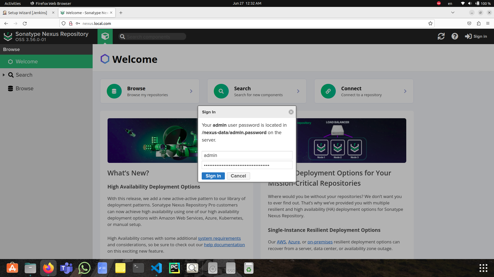

# ITI_Graduation_project
## Project Description: 

## Demo Description:
### Start Minikube and Enable addons: 

---

### Apply Terraform Script: 

---

### Configure /etc/hosts file: 

---

### Get Jenkins Admin Password: 

---

### Connect to Jenkins: 

---

### Get Nexus Admin Password: 

---

### Connect to Nexus: 

---

### Create Nexus User: 

---

### Create Nexus Repo: 

---

### Create Jenkins Credintials for Nexus: 

---

### Run Pipeline: 

---

### Open Application: 

---

### Image Hosted on Nexus: 

---

### Connect to MySql: 

## Contributors:
- [Ahmed Nabil Sharawy](https://www.linkedin.com/in/ahmed-nabil-sharawy-149880104/)
## License
This project is licensed under the [MIT License](LICENSE).

